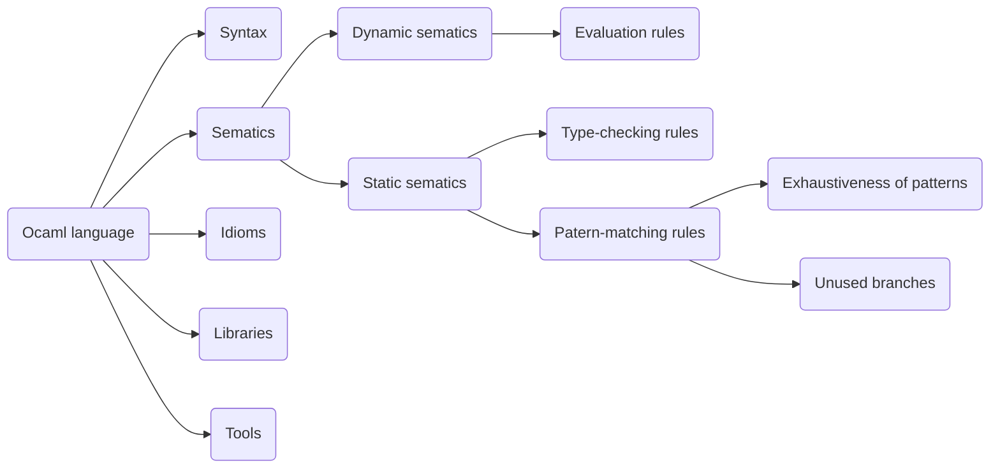

# CS3310: Data Structures and Functional Programming

**Fall 2022 Edition.**

TEXTBOOK: [OCaml Programming: Correct + Efficient + Beautiful](https://cs3110.github.io/textbook/index.html)


## After installing Ocaml

First, initial opam, create a new ocaml switch, and install necessary packages, 
following the installation tutorial.

```bash
opam init --bare -a -y
opam switch create cs3110-2022fa ocaml-base-compiler.4.14.0
eval $(opam env)
opam install -y utop odoc ounit2 qcheck bisect_ppx menhir ocaml-lsp-server ocamlformat ocamlformat-rpc
```

Then install some packages we would like to use in this course.

```bash
opam install -y zarith
```

Finally, we can launch `utop` now!


## Learning Ocaml

